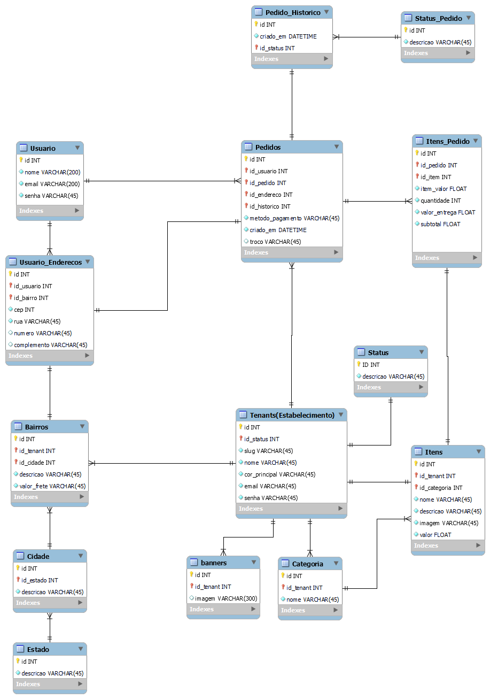

  
 ## Karto
  

## 📁 Informações do projeto:

- O projeto se trata de uma aplicação `multi-tenancy`, ou seja, a aplicação foi projetada para servir múltiplos clientes, também chamados de "inquilinos" ou "tenants", de forma isolada em um único sistema compartilhado. Cada inquilino em uma aplicação multi-tenancy geralmente opera como se tivesse sua própria instância privada da aplicação, com seus próprios dados, configurações e, em muitos casos, sua própria experiência personalizada.

 

- O projeto tem como objetivo servir como expositor de produtos aos estabelecimentos(tenants) com um catalogo de produtos que permite a realização de pedidos pelos usuarios finais (clientes dos estabelecimentos). A aplicação além de suportar diversos estabelecimentos também permite certo nivel de personalização da página de exibição de produtos de cada um.

 

- Cada estabelecimento (tenant) pode cadastrar produtos a serem exibidos, bem como editar e excluir. Além disso o cliente final pode realizar os pedidos pela prorpia plataforma informando os itens e a forma de pagamento.
  *Obs:* A realização das transações de pagamento não ocorrem na plataforma, o objetivo da aplicação é servir como um canal de exposição e pedidos de produtos.

## ✔️ Requisitos para utilização do projeto:
- Possuir o Docker Desktop instalado e devidamente configurado
- Possuir alguma Application Programming Interfaces, preferencialmente o POSTMAN devido as collections que acompanham os arquivos do projeto

## ▶️ Utilização do projeto:

- Para utilização do projeto deve-se seguir os seguintes passos:

1. Após clonar o repositorio e abrir na IDE execute os comandos:

2.  `docker-compose up -d` para subir o container e iniciar os serviços. O container foi divido em três serviços,sendo eles:
- Aplicação
- Banco de Dados
- pgAdmin (SBD)

3. Feito isso, será necessario que acesse o pgAdmin (SBD escolhido) no proprio navegador pelo link: `http://localhost:8081/browser/`

6. Ao acessar, deverá informar as credenciais de acesso ao painel administrativo:

7. email: `gualter@email.com` senha: `postgres`
*Obs:* Essa e outras informações de conexão estão disponiveis no arquivo *.env* que está público propositalmente.

8. Ao acessar, deve clicar em ADICIONAR NOVO SERVIDOR. A seguir os passos:

9. Aba Geral - Nome: `postgres`

10. Aba Conexão - Host: `database`, Port:`5432`, Username: `postgres`, Password: `postgres`

11. Ao clicar em salvar, se todos os dados estiverem corretos você conseguirá conectar com sucesso.

Após realizar esses passos,a API estará em execução e será possivel realizar as requisições.

## ⚙️ Linguagem e Tecnologias utilizadas

- `Typescript`
- `NestJS`
- `TypeORM`
- `Postgres`
- `Docker`

## ⚙️ Modelo Entidade Relacionamento(DER):

  

 

## 🧭 Contrato de rotas da API:

  

